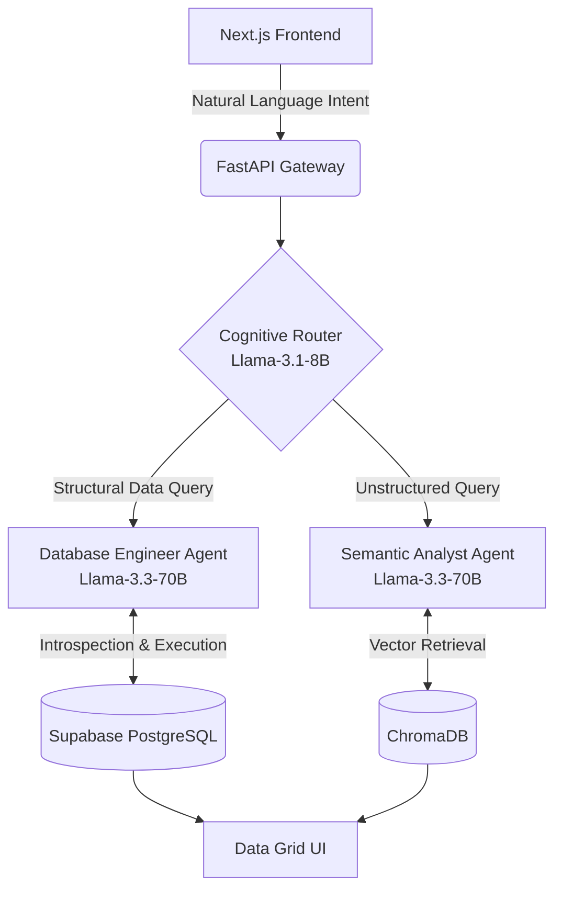

<div align="center">

# OmniData Studio
**Enterprise-Grade Agentic Data Operating System**

[](https://nextjs.org/)
[](https://fastapi.tiangolo.com/)
[](https://supabase.com/)
[](https://groq.com/)
[](https://aistudio.google.com/)
[](https://opensource.org/licenses/MIT)

</div>

## Executive Summary

OmniData Studio is a multi-agent cognitive architecture designed to bridge the gap between unstructured semantic data and strict relational databases. Operating as an AI-native workspace, the platform features a low-latency routing engine that classifies user intent, dynamically introspects live PostgreSQL schemas, and executes deterministic database commands entirely through natural language.

Engineered for maximum efficiency, the system operates with a minimal local hardware footprint. Heavy cognitive processing and inference are entirely offloaded to high-speed cloud infrastructure, allowing deployment and execution on standard development machines without local GPU requirements.

---

## System Architecture

The core of OmniData is a deterministic routing workflow, ensuring zero-hallucination database manipulations and context-aware semantic retrieval.



### 1. The Cognitive Router

Acts as the semantic gatekeeper. It evaluates the user's natural language intent in milliseconds and routes the execution thread deterministically to either the SQL Engine or the Vector RAG Engine.

### 2. The Database Engineer Agent

Handles structural data manipulation with high precision:

* **Dynamic Introspection:** Automatically scans the live Supabase PostgreSQL schema to map exact column data types and relationships.
* **Context Injection:** Injects the live environmental reality into the LLM's context window.
* **Strict Execution:** Translates natural language into type-safe PostgreSQL syntax (handling complex date-math and numeric casting) and executes it directly against the cloud database.

### 3. The Semantic Analyst Agent

Handles unstructured data retrieval. Utilizes local high-dimensional vector embeddings to retrieve mathematically relevant document chunks, executing Context-Augmented Generation (RAG) to ground AI reasoning in historical data.

---

## Multi-Modal ETL Ingestion Pipeline

The platform includes an intelligent API Gateway designed for automated data ingestion:

* **Deterministic Path:** Automatically parses uploaded CSV files into Pandas DataFrames and generates instant, schema-matched SQL tables in Supabase.
* **Multi-Modal Path:** Leverages Google's **Gemini 2.5 Flash** (Vision/Language) to parse unstructured PDF invoices. It enforces strict JSON schema extraction and executes a **Dual-Write**: pushing structured relational data to PostgreSQL while embedding raw semantic text into ChromaDB.

---

## Technical Stack

**Frontend Architecture**

* Next.js 15 (Turbopack)
* React & TypeScript
* Tailwind CSS & Base UI

**Backend Architecture**

* Python 3.12
* FastAPI & Uvicorn
* SQLAlchemy & Pandas

**AI & Database Infrastructure**

* **Orchestration:** Groq API, Google GenAI API
* **Relational Database:** Supabase (PostgreSQL)
* **Vector Storage:** ChromaDB

---

## Deployment & Execution

OmniData Studio is built for a seamless, plug-and-play developer experience.

### Prerequisites

* Python 3.12+
* Node.js 18+
* Active API Keys for Groq, Google GenAI, and Supabase.

### 1. Clone & Configure

```bash
git clone https://github.com/C4RB0Nite/omnidata-studio.git
cd omnidata-studio

```

Create a `.env` file in the root directory and populate it with your credentials:

```text
GROQ_API_KEY=your_key_here
GEMINI_API_KEY=your_key_here
SUPABASE_URL=postgresql://your_connection_uri

```

### 2. Launching the Environment

The repository includes automated execution scripts that bypass manual dependency installation.

**For Windows Users:**
Double-click `start.bat` or run:

```cmd
.\start.bat

```

**For Mac/Linux Users:**

```bash
chmod +x start.sh
./start.sh

```

Upon execution, the script will verify system dependencies, boot the FastAPI backend on port 8000, and launch the Next.js interface on port 3000.

**Type this on your browser:**
```
localhost:3000
```
---

## Connect

Developed by **C4RB0Nite**.

Follow for updates and AI engineering insights: [X (Twitter)](https://x.com/C4RB0Nite)
