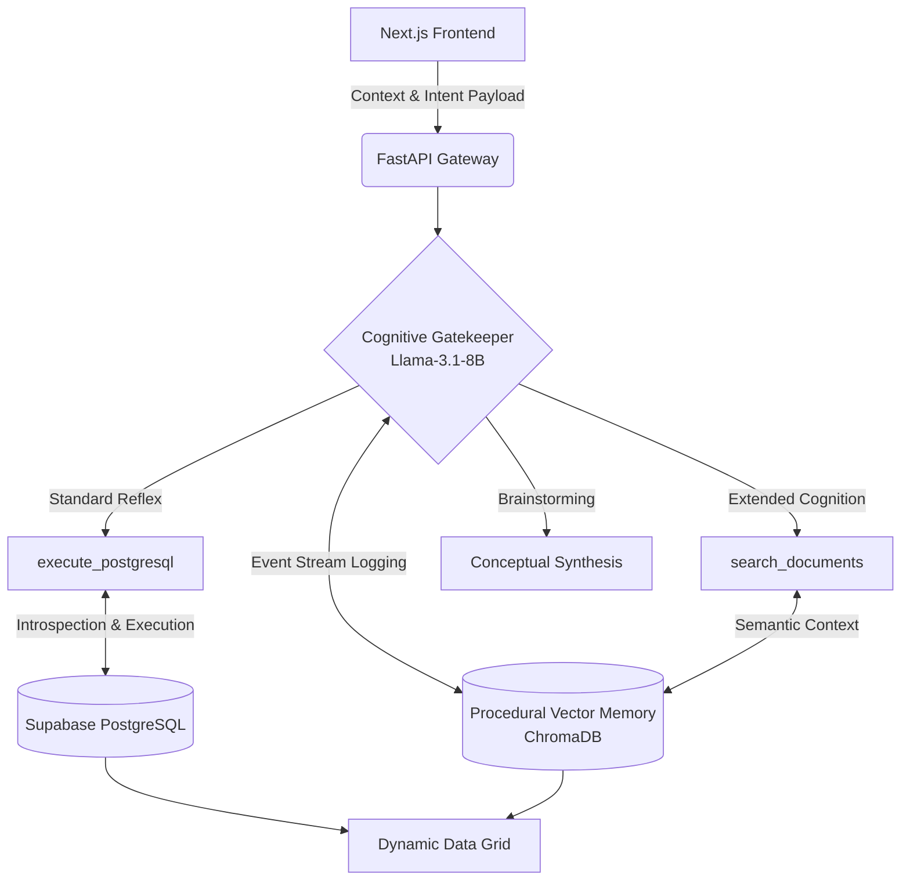

<div align="center">

# OmniData Studio
**Biomimetic Agentic Data Operating System**

[](https://nextjs.org/)
[](https://fastapi.tiangolo.com/)
[](https://supabase.com/)
[](https://groq.com/)
[](https://aistudio.google.com/)
[](https://opensource.org/licenses/MIT)

</div>

## Executive Summary

OmniData Studio is an advanced, multi-agent cognitive architecture designed to bridge the gap between unstructured semantic data and strict relational databases. Operating as an AI-native workspace, the platform features a biomimetic routing engine that evaluates user intent, actively introspects live PostgreSQL schemas, and executes structural database commands autonomously.

Engineered to run efficiently on low-specification local hardware, all heavy cognitive inference and memory encoding are entirely offloaded to high-speed cloud infrastructure (Groq API). This allows for deep procedural memory mapping and complex data orchestration without requiring local GPU compute.

---

## System Architecture

The core of OmniData represents a shift from rigid, rule-based chatbots to a fluid, stateful cognitive loop. It utilizes procedural memory encoding and autonomous semantic tool-calling to triage and execute operations.



### 1. Unified Event Stream (Procedural Memory)

Every user action—from manual SQL queries to file uploads and chat history—is continuously encoded as a semantic event into a localized Vector Database. This allows the system to build indefinite procedural memory, enabling the AI to recall historical workflows without relying on a brittle, short-term context window.

### 2. Cognitive Gatekeeper & Signal Triage

Incoming queries hit an ultra-low-latency classification layer (Llama-3.1-8B). This acts as a primary signal processor, determining the required cognitive depth:

* **Standard Reflex:** For immediate operational tasks, bypassing heavy retrieval.
* **Extended Cognition:** For complex strategic questions, triggering deep retrieval of the user's historical OS actions to synthesize highly contextualized answers.

### 3. Autonomous Tool-Calling & Security

The central reasoning model (Llama-3.3-70B) is equipped with semantic tools rather than hardcoded prompt rules.

* **Stateful Security Hold:** Destructive queries (`DROP`, `DELETE`) generated by the AI are intercepted by a Python-level security layer. The execution is placed in a holding pattern, requiring explicit `YES/NO` user confirmation before continuing.
* **API Fault Tolerance:** The backend is hardened with Regex Interceptors to automatically catch and recover from LLM JSON hallucination faults, alongside Exponential Backoff protocols for external Vision model rate limits.

---

## Multi-Modal ETL Ingestion Pipeline

The platform includes an intelligent API Gateway designed for automated data ingestion:

* **Deterministic Path:** Automatically parses uploaded CSV files into Pandas DataFrames and generates instant, schema-matched SQL tables in Supabase.
* **Multi-Modal Path:** Leverages Google's **Gemini 2.5 Flash** (Vision/Language) to parse unstructured PDF invoices. It enforces strict JSON schema extraction and executes a **Dual-Write**: pushing structured relational data to PostgreSQL while embedding raw semantic text into ChromaDB.

---

## Technical Stack

**Frontend Architecture**

* Next.js 15 (Turbopack)
* React & TypeScript
* Tailwind CSS, Base UI, Dynamic Auto-Resizing CSS Grid

**Backend Architecture**

* Python 3.12
* FastAPI & Uvicorn
* SQLAlchemy & Pandas

**AI & Database Infrastructure**

* **Orchestration:** Groq API (Native Tool Calling), Google GenAI API
* **Relational Database:** Supabase (PostgreSQL)
* **Vector Storage:** ChromaDB

---

## Deployment & Execution

OmniData Studio is built for a seamless, plug-and-play developer experience.

### Prerequisites

* Python 3.12+
* Node.js 18+
* Active API Keys for Groq, Google GenAI, and Supabase.

### 1. Clone & Configure

```bash
git clone [https://github.com/C4RB0Nite/omnidata-studio.git](https://github.com/C4RB0Nite/omnidata-studio.git)
cd omnidata-studio

```

Create a `.env` file in the root directory and populate it with your credentials:

```text
GROQ_API_KEY=your_key_here
GEMINI_API_KEY=your_key_here
SUPABASE_URL=postgresql://your_connection_uri

```

### 2. Launching the Environment

The repository includes automated execution scripts that bypass manual dependency installation and spin up the architecture instantly.

**For Windows Users:**
Double-click `start.bat` or run:

```cmd
.\start.bat

```

**For Mac/Linux Users:**

```bash
chmod +x start.sh
./start.sh

```

Upon execution, the script will verify system dependencies, boot the FastAPI backend on port 8000, and launch the Next.js interface.

**Access the UI at:**

```text
http://localhost:3000

```

---

## Connect

Developed by **C4RB0Nite**.

Follow for updates and AI engineering insights: [X (Twitter)](https://x.com/C4RB0Nite)